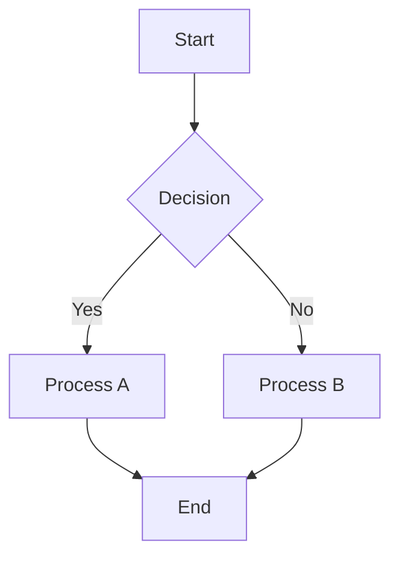
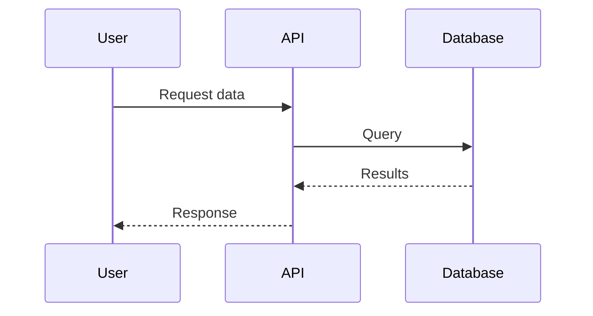
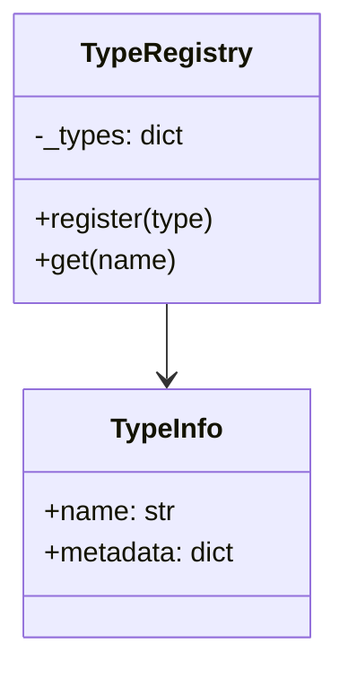
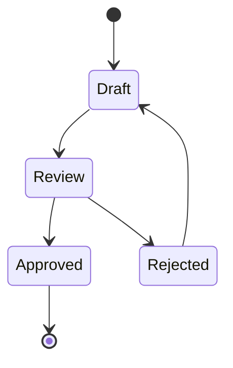
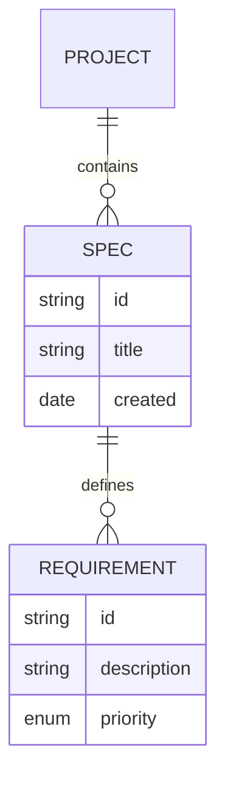
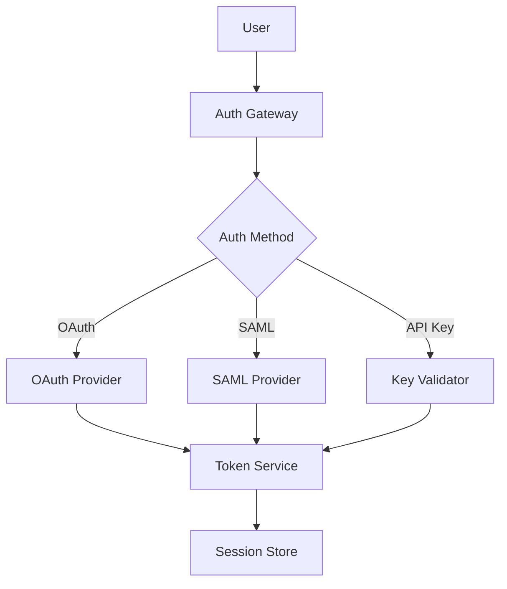
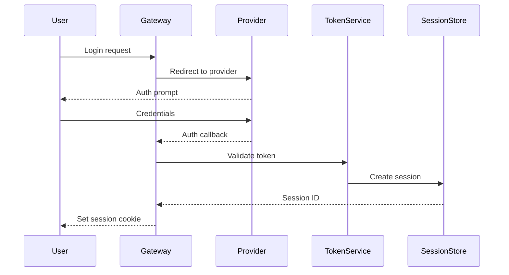

# Specification formatting

This reference covers GitHub Flavored Markdown (GFM) formatting standards for specifications in OAPS projects.

## GitHub Flavored Markdown as standard

GitHub Flavored Markdown is the required format for all specifications. GFM extends CommonMark with:

- Tables
- Task lists
- Strikethrough
- Autolinks
- Fenced code blocks with language hints
- Syntax highlighting

All specifications must be valid GFM and render correctly on GitHub.

## Header hierarchy

Headers create document structure. Follow these rules:

### H1: Document title (only one per file)

```markdown
# Specification title
```

The H1 header appears once at the top of the document. Use sentence case (capitalize only the first word and proper nouns).

### H2: Major sections

```markdown
## Overview
## Requirements
## Architecture
```

H2 headers divide the document into major sections. Common sections include Overview, Requirements, Architecture, Implementation, Testing, and References.

### H3: Subsections

```markdown
### Functional requirements
### Non-functional requirements
```

H3 headers break major sections into subsections. Use sparingly—too many levels create navigation overhead.

### H4-H6: Fine-grained structure

```markdown
#### Component A
##### Implementation detail
###### Edge case
```

Use H4-H6 for detailed breakdowns. Avoid going deeper than H4 unless absolutely necessary—deep hierarchies harm readability.

### Header rules

- Use sentence case for all headers
- No trailing punctuation (periods, colons)
- Include blank line before and after headers
- Don't skip levels (H1 → H3 is invalid; use H1 → H2 → H3)

## Lists

Lists organize related items and create visual hierarchy.

### Unordered lists

```markdown
- First item
- Second item
  - Nested item
  - Another nested item
- Third item
```

Use `-` for bullets (not `*` or `+`) for consistency. Indent nested items with two spaces.

### Ordered lists

```markdown
1. First step
2. Second step
   1. Substep A
   2. Substep B
3. Third step
```

Use `1.` numbering—GFM automatically renumbers. This makes reordering items in diffs cleaner.

### Task lists

```markdown
- [ ] Incomplete task
- [x] Completed task
- [ ] Another incomplete task
  - [x] Completed subtask
  - [ ] Incomplete subtask
```

Task lists are ideal for checklists, requirements tracking, and actionable items.

### List rules

- Use blank lines between list groups (not between items)
- Maintain consistent indentation (two spaces per level)
- Wrap long items across multiple lines with proper indentation
- For multi-paragraph list items, indent continuation paragraphs

```markdown
- First item with a long explanation that wraps across multiple lines
  and continues here.

  Additional paragraph within the same list item.

- Second item
```

## Tables

Tables present structured data with rows and columns.

### Basic table syntax

```markdown
| Column 1      | Column 2      | Column 3      |
|---------------|---------------|---------------|
| Row 1, Cell 1 | Row 1, Cell 2 | Row 1, Cell 3 |
| Row 2, Cell 1 | Row 2, Cell 2 | Row 2, Cell 3 |
```

The header separator row (`|---|---|---|`) is required. Pipe alignment doesn't affect rendering but improves source readability.

### Column alignment

```markdown
| Left aligned | Center aligned | Right aligned |
|:-------------|:--------------:|--------------:|
| Text         | Text           | 123           |
| More text    | More text      | 456           |
```

- `:---` = left aligned (default)
- `:---:` = center aligned
- `---:` = right aligned

Use left alignment for text, right alignment for numbers, center alignment sparingly.

### Table formatting rules

- Align pipes in source for readability
- Use header row to describe columns clearly
- Keep tables simple—complex tables harm readability
- For large datasets, consider linking to CSV/JSON instead
- Break wide tables into multiple narrower tables if possible

### Complex table example

```markdown
| Component    | Status | Coverage | Notes                          |
|:-------------|:------:|---------:|:-------------------------------|
| Parser       | ✓      |    98.2% | All edge cases covered         |
| Validator    | ✓      |    95.1% | Missing error path tests       |
| Generator    | ○      |    87.3% | In progress                    |
```

## Code blocks

Code blocks display source code, commands, and configuration.

### Inline code

```markdown
Use the `format()` function to format strings.
The configuration lives in `.oaps/claude/settings.yml`.
```

Inline code uses single backticks. Use for:

- Function/variable names
- File paths
- Short commands
- Configuration keys

### Fenced code blocks

````markdown
```python
def hello(name: str) -> str:
    """Greet someone by name."""
    return f"Hello, {name}!"
```
````

Fenced code blocks use triple backticks with a language hint. Always include the language hint for syntax highlighting.

### Common language hints

- `python` - Python code
- `bash` - Shell commands
- `yaml` - YAML configuration
- `json` - JSON data
- `typescript` - TypeScript code
- `javascript` - JavaScript code
- `markdown` - Markdown examples
- `sql` - SQL queries
- `dockerfile` - Dockerfiles
- `toml` - TOML configuration

### Shell commands

````markdown
```bash
# Install dependencies
uv sync

# Run tests
uv run pytest

# Format code
uv run ruff format .
```
````

Use `bash` for shell commands. Include comments to explain non-obvious commands.

### Configuration files

````markdown
```yaml
# .oaps/claude/settings.yml
project:
  name: my-project
  version: 1.0.0
```
````

Show configuration examples with appropriate language hints (`yaml`, `toml`, `json`).

### Multi-file examples

When showing multiple related files, use clear labels:

````markdown
**main.py**
```python
from utils import helper

result = helper.process()
```

**utils.py**
```python
def helper() -> dict:
    return {"status": "ok"}
```
````

## Links and cross-references

Links connect related content and external resources.

### External links

```markdown
See [GitHub Flavored Markdown Spec](https://github.github.com/gfm/) for details.
```

Use descriptive link text (not "click here" or bare URLs). The link text should make sense when read aloud.

### Relative links (same repository)

```markdown
See [Architecture Overview](./architecture.md) for system design.
Refer to [API Reference](../references/api.md) for endpoint details.
```

Use relative links for cross-references within the same repository. This keeps links working when the repository is cloned or forked.

### Header anchors

```markdown
See [Requirements](#requirements) section below.
Jump to [Functional requirements](./requirements.md#functional-requirements).
```

GFM auto-generates anchors from headers. Use lowercase with hyphens (spaces → hyphens, remove punctuation).

### Link rules

- Use descriptive text that stands alone
- Prefer relative paths for internal links
- Test all links before committing
- Use reference-style links for repeated URLs

### Reference-style links

```markdown
Check the [GFM spec][gfm] and [Mermaid docs][mermaid] for details.

[gfm]: https://github.github.com/gfm/
[mermaid]: https://mermaid.js.org/
```

Reference-style links improve readability when the same URL appears multiple times.

## Mermaid diagrams

Mermaid creates diagrams from text descriptions. Use Mermaid for all diagrams—never ASCII art or embedded images.

### Flowcharts

````markdown

````

Flowcharts show process flows and decision trees.

### Sequence diagrams

````markdown

````

Sequence diagrams illustrate interactions between components over time.

### Class diagrams

````markdown

````

Class diagrams show object-oriented structures and relationships.

### State diagrams

````markdown

````

State diagrams represent state machines and workflow states.

### Entity relationship diagrams

````markdown

````

ER diagrams model data relationships and database schemas.

### Diagram rules

- Keep diagrams focused on one concept
- Use consistent naming conventions
- Include legends if symbols aren't obvious
- Test rendering in GitHub's preview
- Prefer multiple simple diagrams over one complex diagram

## File naming conventions

Specification files follow consistent naming patterns.

### General rules

- Use kebab-case for file names: `my-spec.md` (not `my_spec.md` or `MySpec.md`)
- Use descriptive names that reflect content: `authentication-flow.md` not `auth.md`
- Use `.md` extension for all Markdown files
- Avoid special characters (stick to `a-z`, `0-9`, `-`)

### Common patterns

```
overview.md              # Project overview
requirements.md          # Requirements specification
architecture.md          # Architecture design
api-reference.md         # API documentation
user-guide.md            # User-facing documentation
contributing.md          # Contribution guidelines
changelog.md             # Change log
```

### Organizational structure

```
specs/
├── overview.md
├── requirements/
│   ├── functional.md
│   └── non-functional.md
├── architecture/
│   ├── system-design.md
│   ├── data-model.md
│   └── api-design.md
└── implementation/
    ├── phase-1.md
    └── phase-2.md
```

Group related specs in subdirectories using logical categories.

## Readability best practices

### Line length

Keep lines reasonable length (80-120 characters) for better diffs and readability in code review tools. Markdown reflows text, so hard wrapping doesn't affect rendering.

```markdown
This is a very long line that exceeds the recommended line length and should be
wrapped to improve readability in source form and make diffs clearer when
reviewing changes.
```

### Blank lines

Use blank lines to create visual separation:

```markdown
## Section header

Introduction paragraph that explains the section.

### Subsection

Content for the subsection.

- List item 1
- List item 2
- List item 3

Another paragraph after the list.
```

Rules:

- One blank line before/after headers
- One blank line between paragraphs
- One blank line before/after lists
- One blank line before/after code blocks
- One blank line before/after tables

### Emphasis and formatting

```markdown
Use **bold** for strong emphasis and important terms.
Use *italic* for mild emphasis and introducing new terms.
Use `code` for technical terms, file names, and function names.
Use ~~strikethrough~~ to show deleted or deprecated content.
```

Don't overuse formatting—it loses impact when everything is emphasized.

### Horizontal rules

```markdown
---
```

Use horizontal rules (`---`) sparingly to separate major sections. Overuse creates visual clutter.

## Complete example

Here's a complete specification demonstrating these formatting standards:

````markdown
# Authentication system specification

This specification defines the authentication and authorization system for the OAPS platform.

## Overview

The authentication system provides secure user identity verification and access control. It supports multiple authentication methods and integrates with existing identity providers.

### Goals

- Secure authentication with industry-standard protocols
- Support for OAuth 2.0, SAML, and API keys
- Fine-grained role-based access control (RBAC)
- Comprehensive audit logging

### Non-goals

- Building a custom identity provider
- Supporting legacy authentication protocols (Basic Auth, Digest Auth)

## Requirements

### Functional requirements

- [ ] Support OAuth 2.0 authentication with major providers (Google, GitHub, Microsoft)
- [ ] Support SAML 2.0 for enterprise SSO integration
- [ ] Generate and validate API keys for programmatic access
- [ ] Implement role-based access control with customizable roles
- [ ] Provide session management with configurable timeouts
- [ ] Log all authentication events for audit purposes

### Non-functional requirements

| Requirement  | Target     | Notes                                    |
|:-------------|:-----------|:-----------------------------------------|
| Availability | 99.9%      | Measured monthly                         |
| Latency      | < 100ms    | p95 for authentication checks            |
| Throughput   | 10K req/s  | Authentication endpoint capacity         |
| Security     | SOC 2      | Compliance with SOC 2 Type II            |

## Architecture

### System components



### Authentication flow



## Implementation

### OAuth 2.0 integration

The system uses the Authorization Code flow with PKCE for enhanced security:

```python
from oaps.auth import OAuthProvider

provider = OAuthProvider(
    client_id="app-client-id",
    client_secret="app-client-secret",
    redirect_uri="https://app.example.com/callback",
    scopes=["openid", "email", "profile"],
)

# Initiate OAuth flow
auth_url = provider.get_authorization_url(state="random-state")

# Handle callback
tokens = provider.exchange_code(code="auth-code", state="random-state")
user_info = provider.get_user_info(tokens.access_token)
```

### Configuration

**config/auth.yml**
```yaml
authentication:
  oauth:
    providers:
      - name: google
        client_id: ${GOOGLE_CLIENT_ID}
        client_secret: ${GOOGLE_CLIENT_SECRET}
        discovery_url: https://accounts.google.com/.well-known/openid-configuration
      - name: github
        client_id: ${GITHUB_CLIENT_ID}
        client_secret: ${GITHUB_CLIENT_SECRET}
        authorization_url: https://github.com/login/oauth/authorize
        token_url: https://github.com/login/oauth/access_token

  session:
    timeout: 7200  # 2 hours
    sliding: true  # Extend on activity
    cookie:
      secure: true
      httponly: true
      samesite: strict
```

## Testing

### Test coverage requirements

- Unit tests: All authentication logic
- Integration tests: End-to-end OAuth/SAML flows
- Security tests: Common attack vectors (CSRF, session fixation, etc.)
- Performance tests: Load testing authentication endpoints

### Test checklist

- [x] OAuth 2.0 flow with Google provider
- [x] OAuth 2.0 flow with GitHub provider
- [ ] SAML authentication flow
- [ ] API key generation and validation
- [ ] Session timeout and renewal
- [ ] Concurrent session limits
- [ ] Brute force protection

## References

See [API Reference](./api-reference.md) for detailed endpoint documentation.

External resources:
- [OAuth 2.0 RFC](https://datatracker.ietf.org/doc/html/rfc6749)
- [SAML 2.0 Specification](https://docs.oasis-open.org/security/saml/v2.0/)
- [OWASP Authentication Cheat Sheet](https://cheatsheetseries.owasp.org/cheatsheets/Authentication_Cheat_Sheet.html)
````

This example demonstrates proper header hierarchy, tables, code blocks, diagrams, lists, and cross-references in a realistic specification format.
